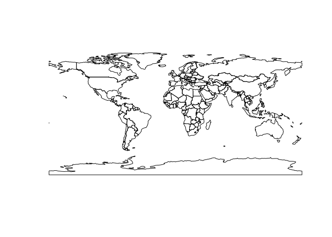
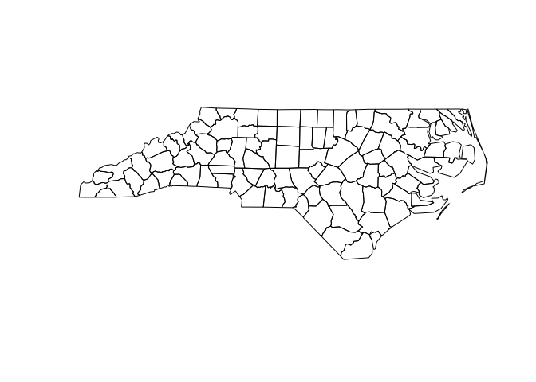

<!-- README.md is generated from README.Rmd. Please edit that file -->

# sfarrow: Read/Write Simple Feature Objects (`sf`) with ‘Apache’ ‘Arrow’

`sfarrow` is a package for reading and writing Parquet and Feather files
with `sf` objects using `arrow` in `R`.

Simple features are a popular format for representing spatial vector
data using `data.frames` and a list-like geometry column, implemented in
the `R` package [`sf`](https://r-spatial.github.io/sf/). Apache Parquet
files are an open-source, column-oriented data storage format
(<https://parquet.apache.org/>) which enable efficient read/writing for
large files. Parquet files are becoming popular across programming
languages and can be used in `R` using the package
[`arrow`](https://github.com/apache/arrow/).

The `sfarrow` implementation translates simple feature data objects
using well-known binary (WKB) format for geometries and reads/writes
Parquet/Feather files. A key goal of the package is for interoperability
of the files (particularly with Python `GeoPandas`), so coordinate
reference system information is maintained in a standard metadata format
(<https://github.com/geopandas/geo-arrow-spec>). Note to users: this
metadata format is not yet stable for production uses and may change in
the future.

## Installation

`sfarrow` is available through CRAN with:

``` r
install.packages('sfarrow')
```

or it can be installed from Github with:

``` r
devtools::install_github("wcjochem/sfarrow@main")
```

Load the library to begin using it.

``` r
library(sfarrow)
```

### `arrow` package

The installation requires the Arrow library which should be installed
with the `R` package `arrow` dependency. However, some systems may need
to follow additional steps to enable full support of that library.
Please refer to the `arrow`
[documentation](https://CRAN.R-project.org/package=arrow/vignettes/install.html).

## Basic usage

Reading Parquet data of spatial files created with Python `GeoPandas`.

``` r
# load Natural Earth low-res dataset. 
# Created in Python with geopandas.to_parquet()
path <- system.file("extdata", "world.parquet", package = "sfarrow")

world <- st_read_parquet(path)

world
#> Simple feature collection with 177 features and 5 fields
#> Geometry type: GEOMETRY
#> Dimension:     XY
#> Bounding box:  xmin: -180 ymin: -90 xmax: 180 ymax: 83.64513
#> Geodetic CRS:  WGS 84
#> # A tibble: 177 × 6
#>      pop_est continent     name      iso_a3 gdp_md_est                  geometry
#>        <int> <chr>         <chr>     <chr>       <dbl>            <GEOMETRY [°]>
#>  1    920938 Oceania       Fiji      FJI         8374  MULTIPOLYGON (((180 -16.…
#>  2  53950935 Africa        Tanzania  TZA       150600  POLYGON ((33.90371 -0.95…
#>  3    603253 Africa        W. Sahara ESH          906. POLYGON ((-8.66559 27.65…
#>  4  35623680 North America Canada    CAN      1674000  MULTIPOLYGON (((-122.84 …
#>  5 326625791 North America United S… USA     18560000  MULTIPOLYGON (((-122.84 …
#>  6  18556698 Asia          Kazakhst… KAZ       460700  POLYGON ((87.35997 49.21…
#>  7  29748859 Asia          Uzbekist… UZB       202300  POLYGON ((55.96819 41.30…
#>  8   6909701 Oceania       Papua Ne… PNG        28020  MULTIPOLYGON (((141.0002…
#>  9 260580739 Asia          Indonesia IDN      3028000  MULTIPOLYGON (((141.0002…
#> 10  44293293 South America Argentina ARG       879400  MULTIPOLYGON (((-68.6340…
#> # ℹ 167 more rows
plot(sf::st_geometry(world))
```



Writing `sf` objects to Parquet format files. These Parquet files
created with `sfarrow` can be read within Python using `GeoPandas`.

``` r
nc <- sf::st_read(system.file("shape/nc.shp", package="sf"), quiet=TRUE)

st_write_parquet(obj=nc, dsn=file.path(tempdir(), "nc.parquet"))

# read back into R
nc_p <- st_read_parquet(file.path(tempdir(), "nc.parquet"))

nc_p
#> Simple feature collection with 100 features and 14 fields
#> Geometry type: MULTIPOLYGON
#> Dimension:     XY
#> Bounding box:  xmin: -84.32385 ymin: 33.88199 xmax: -75.45698 ymax: 36.58965
#> Geodetic CRS:  NAD27
#> # A tibble: 100 × 15
#>     AREA PERIMETER CNTY_ CNTY_ID NAME  FIPS  FIPSNO CRESS_ID BIR74 SID74 NWBIR74
#>    <dbl>     <dbl> <dbl>   <dbl> <chr> <chr>  <dbl>    <int> <dbl> <dbl>   <dbl>
#>  1 0.114      1.44  1825    1825 Ashe  37009  37009        5  1091     1      10
#>  2 0.061      1.23  1827    1827 Alle… 37005  37005        3   487     0      10
#>  3 0.143      1.63  1828    1828 Surry 37171  37171       86  3188     5     208
#>  4 0.07       2.97  1831    1831 Curr… 37053  37053       27   508     1     123
#>  5 0.153      2.21  1832    1832 Nort… 37131  37131       66  1421     9    1066
#>  6 0.097      1.67  1833    1833 Hert… 37091  37091       46  1452     7     954
#>  7 0.062      1.55  1834    1834 Camd… 37029  37029       15   286     0     115
#>  8 0.091      1.28  1835    1835 Gates 37073  37073       37   420     0     254
#>  9 0.118      1.42  1836    1836 Warr… 37185  37185       93   968     4     748
#> 10 0.124      1.43  1837    1837 Stok… 37169  37169       85  1612     1     160
#> # ℹ 90 more rows
#> # ℹ 4 more variables: BIR79 <dbl>, SID79 <dbl>, NWBIR79 <dbl>,
#> #   geometry <MULTIPOLYGON [°]>
plot(sf::st_geometry(nc_p))
```



For additional examples please see the vignettes.

## Contributions

Contributions, questions, ideas, and issue reports are welcome. Please
raise an issue to discuss or submit a pull request.

## Acknowledgements

This work benefited from the work by developers in the GeoPandas, Arrow,
and r-spatial teams. Thank you to the teams for their excellent,
open-source work.
